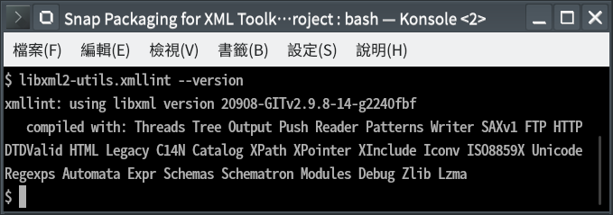

# Snap Packaging for XML Toolkit from the GNOME Project

  ![Icon of [Project]](gui/icon.png "Icon of [Project]")

**This is the snap for XML Toolkit from the GNOME Project**, *"XML C parser and toolkit developed for the Gnome project (but usable outside of the Gnome platform)"*. It works on Ubuntu, Fedora, Debian, and other major Linux distributions.

Published for  with 💝 by Snapcrafters

## Installation
([Don't have the `snap` command installed?](https://snapcraft.io/docs/core/install))

    # Install Snap #
    sudo snap install --channel=edge --devmode libxml2-utils
    #sudo snap install --channel=beta libxml2-utils
    #sudo snap install libxml2-utils
    
    # Connect the Snap to Optional Interfaces #
    ## `removable-media`: For accessing XML files in removable media storage devices ##
    sudo snap connect libxml2-utils:removable-media

## What is Working

* [A list of functionallities that are verified working]

## What is NOT Working...yet 

* [A list of functionallities that are verified not working]

## What is NOT Tested...yet

* [A list of functionallities that are not tested for any reasons.]

## Support

* Report issues regarding using this snap to the issue tracker:  
  <https://github.com/Lin-Buo-Ren/libxml2-snap/issues>

* You may also post on the Snapcraft Forum, under the `snap` topic category:  

  <https://forum.snapcraft.io/c/snap>

